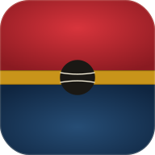

# Marcador Pilota Valenciana — Llargues

Marcador digital per a partides de pilota valenciana en modalitat **llargues amb ralles**, instal·lable al mòbil com a app (PWA).



---

## ⚡ Resum ràpid

És un projecte **Vite + React + PWA**. Una vegada desplegat (Vercel d'un clic, Netlify, GitHub Pages…), pots obrir la URL al mòbil i instal·lar-lo com a app real, amb icona a la pantalla d'inici i funcionament offline.

---

## 🚀 Opció A — Desplegar a Vercel en 2 minuts (recomanada)

1. Comprimeix la carpeta del projecte i puja-la a un repositori de **GitHub** (o usa la CLI de Vercel directament: `vercel --prod`).
2. Entra a [vercel.com/new](https://vercel.com/new), connecta el repo. Vercel detecta automàticament que és Vite — només has de fer clic a **Deploy**.
3. En 30 segons tindràs una URL del tipus `https://llargues.vercel.app`.
4. Obre eixa URL al mòbil i instal·la-la (vegeu sota).

**Alternativa amb la CLI de Vercel** (encara més ràpid si ja la tens):

```bash
npm install
vercel --prod
```

---

## 🛠️ Opció B — Provar en local

```bash
npm install
npm run dev
```

Vite et donarà dues URLs: una local (`http://localhost:5173`) i una de la xarxa (`http://192.168.x.x:5173`). Obri la de la xarxa al mòbil que estiga connectat al mateix WiFi i ja podràs jugar.

> ⚠️ La instal·lació com a PWA al mòbil requereix **HTTPS**. En desenvolupament local, iOS no et deixarà instal·lar-la. Per a això, cal desplegar (opció A) o usar `ngrok`.

---

## 📲 Instal·lar al mòbil

### iPhone / iPad (Safari)

1. Obre la URL en **Safari** (no Chrome — al iPhone Chrome no permet instal·lar PWAs).
2. Toca el botó de compartir (📤 quadrat amb fletxa cap amunt).
3. Desplaça i toca **Afegir a la pantalla d'inici** / *Add to Home Screen*.
4. Confirma. L'app apareixerà a la pantalla d'inici amb la icona del marcador.
5. En obrir-la, no es veurà la barra de Safari — funcionarà com una app nativa.

### Android (Chrome / Edge / Firefox)

1. Obre la URL en Chrome.
2. Apareixerà automàticament una barra inferior amb **Instal·lar app** o el menú ⋮ → **Instal·lar app** / **Afegir a la pantalla d'inici**.
3. Confirma. La icona apareixerà al calaix d'apps i a la pantalla d'inici.
4. Funcionament idèntic a una app nativa, també offline.

---

## 🎮 Com s'usa

### Setup inicial

En obrir l'app per primera vegada:
- Ompli el **poble** de cada equip (opcional — si està buit es mostra ROIG / BLAU).
- Afegeix **els jugadors** de cada equip (mínim 3, màxim 5).
- Tria **qui trau** primer tocant el botó del seu equip → arranca la partida.

### Durant la partida

- Botons grans **+1 PUNT** als panels de cada equip per a sumar punt.
- **RALLA 1** i **RALLA 2** als botons inferiors.
- **DESFER** per a desfer l'últim moviment (fins a 40 estats d'històric).
- **NOVA** (cantó superior) per a començar una partida nova mantenint els equips.

### Regles implementades

- **Puntuació**: 0 → 15 → 30 → VAL → Joc
- **A DOS**: en arribar a VAL/VAL torna automàticament a 30/30 (es mostra "A DOS" daurat)
- **Partida a 10 jocs**
- **Ralles**:
  - Ralla 1 + Ralla 2 → canvi de trau + resolució seqüencial
  - **Excepció VAL + Ralla 1** → canvi de camp i de trau, resolució directa
  - Punts directes permesos també amb Ralla 1 marcada

---

## 📁 Estructura

```
pelota-app/
├── index.html               · meta tags PWA, iOS, viewport
├── package.json             · React 18 + Vite 6 + tailwindcss 4 + vite-plugin-pwa
├── vite.config.js           · config PWA (manifest, service worker, cache)
├── vercel.json              · headers cache i deploy config
├── public/
│   ├── icon.svg             · icona vectorial mestra
│   ├── icon-192.png         · icona 192×192
│   ├── icon-512.png         · icona 512×512
│   ├── icon-512-maskable.png · icona maskable Android
│   ├── apple-touch-icon.png · icona iOS (180×180)
│   ├── favicon-32.png       · favicon
│   └── manifest.webmanifest · manifest PWA
└── src/
    ├── main.jsx             · entry React
    ├── PelotaScoreboard.jsx · component principal (1500 línies)
    └── index.css            · reset + Tailwind v4
```

---

## 🔧 Tecnologies

- **Vite 6** — bundler i dev server
- **React 18** — UI
- **Tailwind CSS 4** — utilitats CSS
- **vite-plugin-pwa** — service worker (Workbox) i manifest automàtic
- **Google Fonts** — Big Shoulders Display, Fraunces, JetBrains Mono (cacheades pel SW)

---

## 📦 Vols un APK natiu d'Android?

La PWA ja s'instal·la com app — però si vols un APK signat per distribuir fora de la Play Store, pots embolcallar el projecte amb **Capacitor**:

```bash
npm install @capacitor/core @capacitor/cli @capacitor/android
npx cap init "Llargues" "com.tudomini.llargues"
npm run build
npx cap add android
npx cap copy
npx cap open android
```

Això obrirà Android Studio amb el projecte. Des d'allí pots generar un APK signat (`Build → Generate Signed Bundle/APK`). Cal tenir Android Studio + JDK instal·lats.

Per a iOS és similar amb `@capacitor/ios` + Xcode (i un compte d'Apple Developer si vols distribuir).

---

## 📝 Llicència

Codi privat. Adapta-ho a les teues necessitats.
